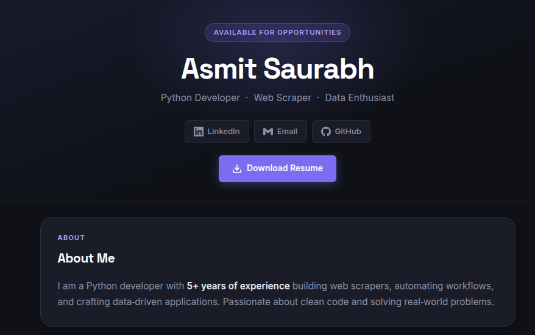

# Asmit Saurabh – Python Developer Portfolio 🚀

A personal portfolio website showcasing my projects, skills, and experience as a Python Developer.

🌐 **Live Site:** [saurabhasmt.github.io](https://saurabhasmt.github.io/)

---

## 📸 Preview

[](https://saurabhasmt.github.io/)

---

## 🛠️ Built With

| Category | Technology |
|----------|-----------|
| **Markup** | HTML5 (semantic elements) |
| **Styling** | Vanilla CSS3 (no frameworks) |
| **Fonts** | Google Fonts |
| **Icons** | Inline SVG |
| **Hosting** | GitHub Pages |

> ⚡ No JavaScript frameworks, no CSS libraries (like Bootstrap or Tailwind) — pure HTML & CSS only.

---

## 🎨 Typography

| Role | Font | Weights Used |
|------|------|-------------|
| **Headings** (h1, h2, h3) | [Space Grotesk](https://fonts.google.com/specimen/Space+Grotesk) | 400 · 500 · 600 · 700 |
| **Body text** | [Inter](https://fonts.google.com/specimen/Inter) | 400 · 500 · 600 · 700 · 800 |

Both fonts are loaded via **Google Fonts CDN**.

---

## 🎨 Design Highlights

- **Dark theme** — deep navy/charcoal background (`#0f1117`)
- **Purple accent system** — primary colour `#7c6df0` used consistently for highlights, tags, and interactive elements
- **CSS custom properties** — all design tokens (colours, radii, shadows) defined in `:root` for easy theming
- **Smooth transitions** — hover effects on cards, buttons, and skill tags
- **Responsive layout** — adapts cleanly to mobile screens via `@media (max-width: 600px)`
- **Compact spacing** — tight, intentional gaps instead of large empty sections

---

## 📁 File Structure

```
├── index.html       # Main HTML page
├── style.css        # All styles (vanilla CSS)
├── resume.pdf       # Downloadable resume
├── screenshot.png   # Portfolio preview image
└── README.md        # This file
```

---

## ✉️ Contact

- **LinkedIn:** [linkedin.com/in/asmit-saurabh-108](https://www.linkedin.com/in/asmit-saurabh-108/)
- **Email:** [saurabhasmit8@gmail.com](mailto:saurabhasmit8@gmail.com)
- **GitHub:** [github.com/SaurabhAsmt](https://github.com/SaurabhAsmt)

---

© 2026 Asmit Saurabh · All rights reserved


